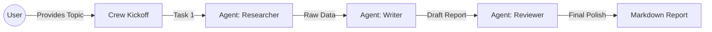

# 🤖 Multi-Agent AI System


A sophisticated multi-agent AI system built using the **CrewAI** framework and **LangChain**. This system demonstrates role-based AI agents collaborating autonomously to conduct deep technical research, write structured reports, and review the final output for accuracy and polish.

## ✨ Features

- **Role-Based Collaboration**: Specialized agents (Researcher, Writer, Reviewer) work together seamlessly.
- **Sequential Process Flow**: Ensures logical task execution from research to review.
- **Extensible Toolkit**: Easy integration with Langchain tools for real-time web search or API access.
- **Automated Formatting**: Generates clean, ready-to-publish Markdown reports.

## 🏗️ Architecture



## 🚀 Installation

1. **Clone the repository:**
   ```bash
   git clone https://github.com/yourusername/multi-agent-ai-system.git
   cd multi-agent-ai-system
   ```

2. **Set up virtual environment:**
   ```bash
   python -m venv venv
   source venv/bin/activate
   ```

3. **Install dependencies:**
   ```bash
   pip install -r requirements.txt
   ```

4. **Environment Variables:**
   Rename `.env.example` to `.env` and add your LLM API keys (e.g., OpenAI API Key).

## 💻 Usage

Run the main orchestrator script:
```bash
python main.py
```
You will be prompted to enter a topic. The terminal will display the verbose thinking process of the agents, and finally save a Markdown file (`report_topic_name.md`) containing the finished article.

## 📊 Results Example
For a prompt like "Quantum Machine Learning", the system outputs a 1,000-word markdown report complete with introduction, technical bullet points, current state of the art, and conclusion—entirely autonomously!
